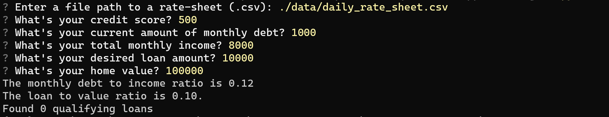

# Loan Qualifier CLI Application

This is a Python application where users get a list of the loans they qualify for. It is a command-line interface where users input their personal information and then the application returns the number of qualifying loans that meet the user's requirements. After that the users have the possibility to save the list of loans they qualify for to a CSV file.


---

## Technologies

The technologies used in this project include:

   * Python 3.7
   * [Fire](https://github.com/google/python-fire) - A Python library for generating command-line interfaces (CLIs) from Python code.
   * [Questionary](https://github.com/tmbo/questionary) - A Python library that provides a user-friendly interface for creating interactive command-line prompts and handling user input.


---

## Installation Guide

To use this appliaction install the packages **Fire** and **Questionary**. To install these follow the guide below:

```python
  pip install fire
  pip install questionary
```

---

## Usage

Clone the repository and run the **app.py** file as demonstrated below:

```python
python app.py
```

 The following prompts will appear during the application's execution:

  

 If **no** qualifying loans **exist** the appliaction prints the following message and exits:

 


If qualifying loans **exist** the user is prompted with the option to save the results to a CSV file as follows:


---

## Contributors

* Ana Martelo (anafilipamartelo@gmail.com)

---

## License

MIT
